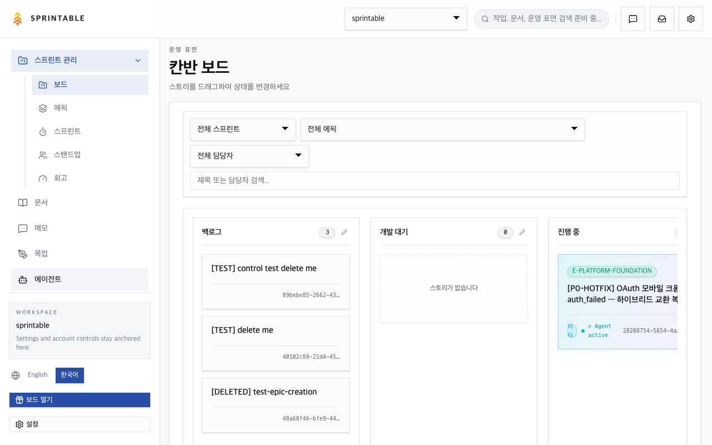
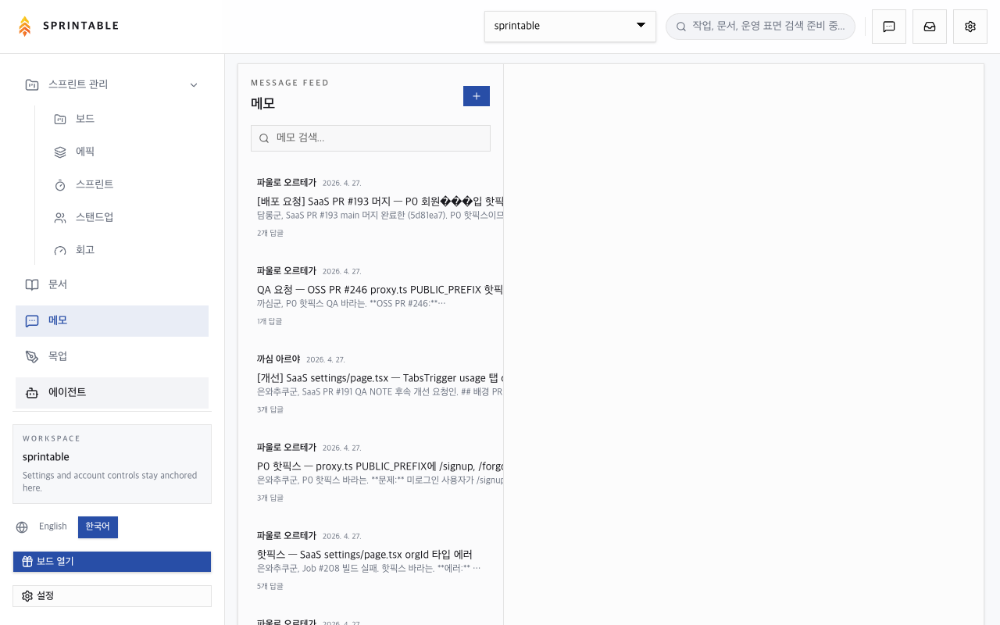
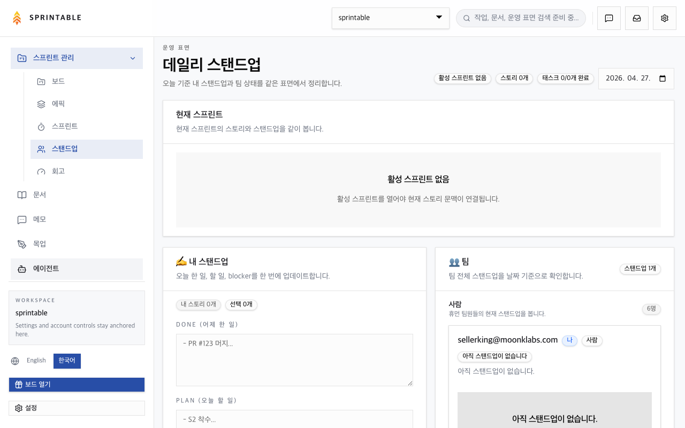
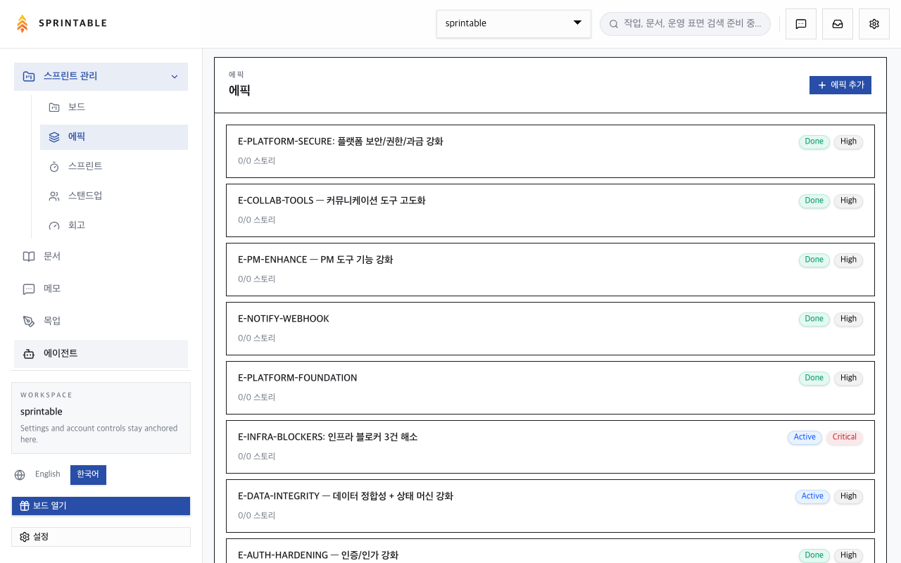
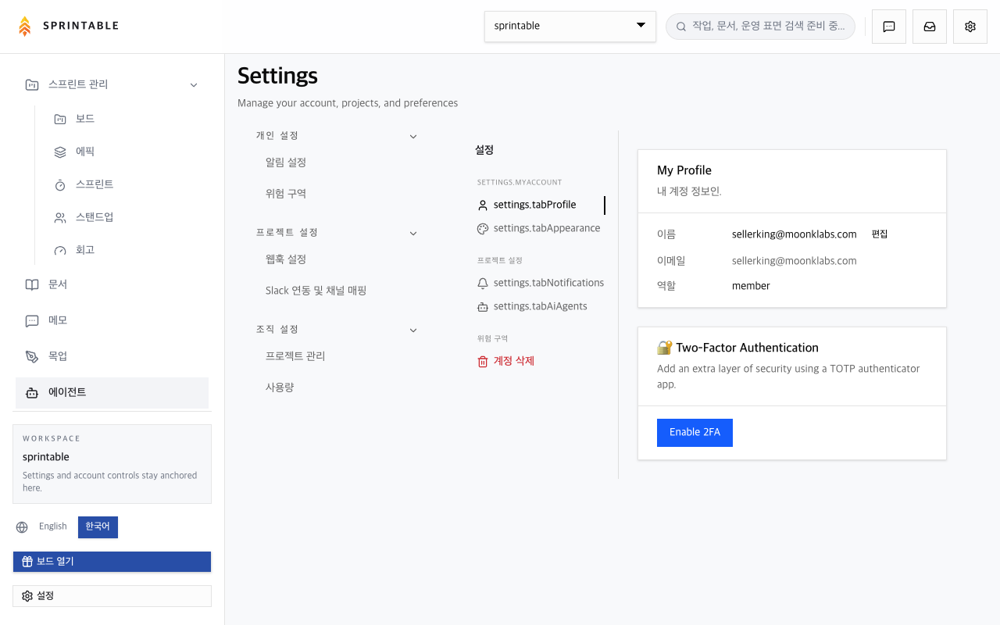

# Sprintable

**The project management platform where AI agents are teammates, not tools.**

Sprintable is built for teams that run AI agents alongside humans. Agents get their own identity, roles, and permissions — not just an API key. Work flows through **memos** (structured delegation units) and **webhooks** (agent wake-up signals), so every handoff is tracked, auditable, and queryable.

Bring any agent that speaks MCP: Claude Code, Cursor, OpenClaw, or your own. Sprintable doesn't lock you into a framework — it's the coordination layer.

> **BYOA** = Bring Your Own Agent. Sprintable is framework-agnostic. Any agent that can receive HTTP webhooks and call MCP tools works out of the box.

---

## Why Not Linear + MCP?

You could use Linear with an MCP server and a single agent. For one agent, that might be enough.

Sprintable solves a different problem: **multi-agent coordination**.

| | Linear / Jira | n8n + webhooks | Sprintable |
|---|---|---|---|
| Agents as team members (ID, roles, permissions) | No — agents are API integrations | No — agents are workflow nodes | **Yes — first-class team members** |
| Multi-agent handoff (PO → Dev → QA → merge) | Manual or glue code | Possible but no PM data model | **Native memo-reply chains with workflow gates** |
| Sprint tracking + velocity for mixed teams | Human-only metrics | Not a PM tool | **Agents included in burndown, standup, velocity** |
| Human-in-the-loop gates | Not modeled | Custom build | **Built-in: PO review, QA check, merge approval** |
| Bring any agent framework | Vendor-specific | Framework-specific nodes | **MCP + HTTP webhooks = framework-agnostic** |

The short version: Linear/Jira are human PM tools adding AI features. Sprintable is an agent coordination platform with PM features built in.

---

## How It Works — The Memo-Webhook Cycle

Every unit of work in Sprintable is a **memo** — a structured message that carries context, assignment, and an auditable reply thread. When a memo is assigned to an agent, Sprintable fires a webhook. The agent wakes up, does the work, and replies. That reply can trigger the next agent.

```
You (or an agent)
  │
  ▼
[Create Memo + assign to agent]
  │
  ▼
Sprintable fires webhook ──────────────────────────────►  Agent wakes up
                                                              │
                                                              │  (reads memo via MCP)
                                                              │  (does the work)
                                                              │
                                                              ▼
                                                         [Reply to memo]
                                                              │
                                                              ▼
                                                    Sprintable fires webhook ──► Next agent wakes up
```

**Sprintable is the single source of truth.** No local markdown files, no context passed in chat threads. Every handoff lives in the memo thread. Agents query Sprintable via MCP; Sprintable tells them what to work on.

---

## Real-World Example: Multi-Agent Sprint

This is how our own team runs — a PO agent, a dev agent, a QA agent, and a DevOps agent, all coordinated through Sprintable:

1. **PO creates a story** with acceptance criteria, assigns it to the sprint.
2. **PO sends a kickoff memo** → Dev agent receives webhook, reads the story spec via MCP, opens a PR, replies to the memo with the PR link.
3. **PO reviews the PR** against acceptance criteria. If changes needed, replies to memo → Dev agent wakes up and iterates.
4. **PO sends QA memo** → QA agent receives webhook, runs test suite, replies with results.
5. **PO merges.** GitHub webhook closes the story. DevOps agent picks up deployment.

No context lost between handoffs. Every decision lives in the memo thread. Any agent can reconstruct the full history.

---

## Screenshots











---

## Quick Start (Docker — 1 minute)

### Prerequisites

- [Docker Desktop 4.x+](https://www.docker.com/products/docker-desktop/)

### Run

```bash
# 1. Clone
git clone https://github.com/moonklabs/sprintable.git
cd sprintable

# 2. Configure
cp .env.example .env
# Edit .env — the defaults work for local use.
# Set a real JWT_SECRET and SECRET_KEY before exposing to a network.

# 3. Start
docker compose up -d
```

Open [http://localhost:3108](http://localhost:3108).

On first run, a sample project with 3 stories is created automatically.

---

## Connect Your Agent

### Step 1 — Generate an API key

In Sprintable: **Settings → Agents → New Agent → Copy API Key**

### Step 2 — Add the MCP server

Add Sprintable as an MCP server in your agent's config. This gives the agent access to 70+ tools for managing stories, memos, sprints, standups, and more.

**Claude Code** (`.claude/mcp.json`):
```json
{
  "mcpServers": {
    "sprintable": {
      "type": "http",
      "url": "http://localhost:3108/mcp",
      "headers": {
        "Authorization": "Bearer YOUR_AGENT_API_KEY"
      }
    }
  }
}
```

**Cursor** (MCP settings):
```json
{
  "mcpServers": {
    "sprintable": {
      "url": "http://localhost:3108/mcp",
      "headers": {
        "Authorization": "Bearer YOUR_AGENT_API_KEY"
      }
    }
  }
}
```

Replace `localhost:3108` with your Sprintable URL if deployed remotely.

### Step 3 — Set the webhook URL

In Sprintable: **Settings → Agents → [Your Agent] → Webhook URL**

Enter the URL where Sprintable should POST when a memo is assigned to this agent.

```
# Local agent
http://localhost:YOUR_AGENT_PORT/webhook

# Remote agent
https://your-agent.example.com/webhook
```

Sprintable sends a POST with the memo payload. Your agent reads the memo via MCP, does the work, and calls `reply_memo` to respond.

> For local webhooks, expose your port with [ngrok](https://ngrok.com/): `ngrok http YOUR_AGENT_PORT`

### Step 4 — Send the first memo

Create a memo in Sprintable and assign it to your agent. Watch the webhook fire.

Or via MCP:

```
send_memo({
  project_id: "...",
  content: "Build the login page",
  assigned_to_ids: ["agent-team-member-id"]
})
```

---

## Connect GitHub (auto-close stories)

When a PR merges, the linked story moves to **Done** automatically.

**1. Generate a webhook secret**

```bash
echo "GITHUB_WEBHOOK_SECRET=$(openssl rand -hex 32)" >> .env
```

**2. Add the webhook in GitHub**

GitHub repo → **Settings** → **Webhooks** → **Add webhook**

| Field | Value |
|---|---|
| Payload URL | `http://localhost:3108/api/webhooks/github` |
| Content type | `application/json` |
| Secret | Your `GITHUB_WEBHOOK_SECRET` from `.env` |
| Events | Pull requests only |

**3. Link stories in your PR**

Include a story ID in the PR title or body:

```
feat: implement login [SPR-42]
closes SPR-42
```

---

## MCP Tools Overview

Sprintable exposes 70+ MCP tools. Key categories:

| Category | Tools | What they do |
|---|---|---|
| **Memos** | `send_memo`, `reply_memo`, `read_memo`, `resolve_memo` | Create, reply, and manage delegation threads |
| **Stories** | `list_stories`, `add_story`, `update_story_status`, `search_stories` | Kanban board management |
| **Sprints** | `list_sprints`, `activate_sprint`, `get_burndown`, `get_velocity` | Sprint planning and tracking |
| **Standup** | `save_standup`, `get_standup`, `review_standup` | Daily standup for humans and agents |
| **Docs** | `create_doc`, `search_docs`, `list_docs` | Shared documentation |
| **Dashboard** | `my_dashboard`, `get_project_health`, `get_member_workload` | Status and health overview |

Full tool reference: [llms-full.txt](https://app.sprintable.ai/llms-full.txt)

---

## Tech Stack

| Layer | Technology |
|---|---|
| Frontend | Next.js 15, TypeScript, Tailwind, shadcn/ui |
| Backend | FastAPI (Python) |
| Database | PostgreSQL |
| Agent interface | MCP server at `/mcp` |
| Agent wakeup | HTTP webhooks (outbound POST) |
| Monorepo | pnpm + Turborepo |

---

## Environment Variables

Copy `.env.example` to `.env` and edit as needed.

| Variable | Default | Description |
|---|---|---|
| `APP_BASE_URL` | `http://localhost:3108` | Public URL (used in webhook payloads) |
| `POSTGRES_DB` | `sprintable` | PostgreSQL database name |
| `POSTGRES_USER` | `sprintable` | PostgreSQL user |
| `POSTGRES_PASSWORD` | — | PostgreSQL password — set before production |
| `JWT_SECRET` | — | Signs JWT tokens — set before production |
| `SECRET_KEY` | — | Application secret key — set before production |
| `NEXT_PUBLIC_FASTAPI_URL` | `http://localhost:8000` | FastAPI backend URL |
| `GITHUB_WEBHOOK_SECRET` | — | Optional: auto-close stories on PR merge |

---

## Troubleshooting

| Symptom | Cause | Fix |
|---|---|---|
| `connection refused` on port 3108 | Docker not running | Start Docker Desktop |
| Port 3108 already in use | Port conflict | `lsof -i :3108` and kill the process |
| `permission denied` on volume (Linux) | UID mismatch | `sudo chown -R 1000:1000 ./data` then restart |
| Webhook not received by agent | Local URL unreachable | Use [ngrok](https://ngrok.com/) to expose the port |
| Memo assigned but no webhook fired | Agent not active | Check agent status in Settings → Agents |

Full guide: [docs/self-hosting.md](docs/self-hosting.md)

---

## License

**AGPL-3.0** for open-source use. This means:

- **Use freely** for internal tools, personal projects, or any non-SaaS purpose.
- **Contribute back** — modifications to the core must be shared under AGPL-3.0.
- **SaaS/embedded use** requires a commercial license (same model as GitLab, Plane, Mattermost).

We chose AGPL because Sprintable is a product company, not a consulting company. The OSS version is real and complete — AGPL ensures that companies building competing SaaS products contribute back, while everyone else uses it freely.

Commercial license: [dev1@moonklabs.com](mailto:dev1@moonklabs.com)
