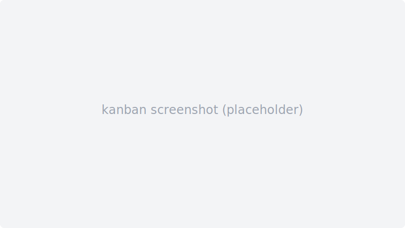
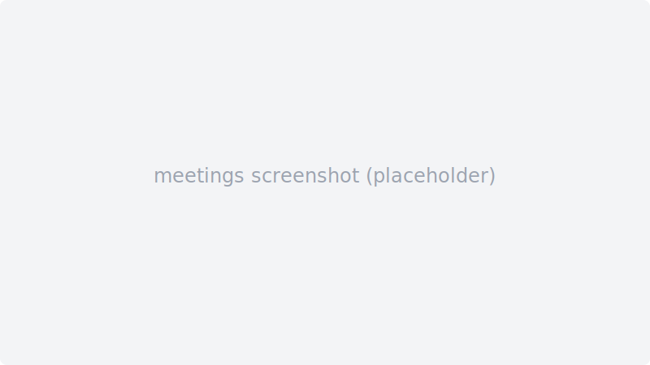
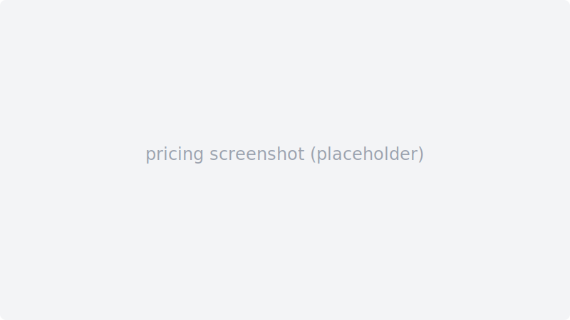

# 🚀 Sprintable

**AI-powered sprint management for modern development teams.**

Sprintable combines agile project management with AI agents to automate standups, code reviews, meeting notes, and sprint operations — all in one platform.

<p align="center">
  
  
  
</p>

> 📸 **Note**: Replace placeholder images with actual screenshots after first deployment. Run `pnpm dev` and capture the kanban board, meeting notes, and pricing pages.

## ✨ Features

- **📋 Kanban Board** — Stories, epics, sprints with drag-and-drop
- **🤖 AI Agents** — Automated standups, code reviews, meeting summaries
- **🎙 Meeting Notes** — Browser recording, STT transcription, AI structuring
- **📝 Memos** — Team communication with @mentions and threading
- **📊 Analytics** — Velocity tracking, burndown charts, team workload
- **🎨 Mockup Editor** — Drag-and-drop UI prototyping
- **📄 Docs** — Markdown documentation with version history
- **🏆 Rewards** — Gamified team recognition
- **🔌 MCP Server** — AI agent integration via Model Context Protocol

## 🛠 Tech Stack

| Layer | Technology |
|-------|-----------|
| **Frontend** | Next.js 15, React 19, Tailwind CSS, next-intl |
| **Backend** | Next.js API Routes, Supabase (Postgres + Auth + Storage) |
| **AI** | OpenAI GPT-4o-mini, Anthropic Claude, Whisper STT |
| **MCP** | @modelcontextprotocol/sdk |
| **Monorepo** | pnpm workspaces, Turborepo |

## 📦 Project Structure

```
sprintable/
├── apps/web/              # Next.js frontend + API routes
├── packages/
│   ├── db/                # Supabase migrations + types
│   ├── mcp-server/        # MCP tool server (stdio/SSE)
│   └── shared/            # Shared schemas + utilities
└── docs/                  # Documentation
```

## 🚀 Quick Start

### Prerequisites

- Node.js 20+
- pnpm 9+
- Supabase project (local or cloud)

### Installation

```bash
# Clone
git clone https://github.com/moonklabs/sprintable.git
cd sprintable

# Install dependencies
pnpm install

# Copy environment variables
cp .env.example apps/web/.env.local

# Run database migrations
pnpm --filter @sprintable/db migrate

# Start development server
pnpm dev
```

Visit `http://localhost:3000` to get started.

### MCP Server

```bash
# stdio mode (for Claude Desktop, Codex, etc.)
pnpm --filter @sprintable/mcp-server start

# SSE mode (for web clients)
MCP_MODE=sse MCP_PORT=3100 pnpm --filter @sprintable/mcp-server start
```

## 🧪 Development

```bash
pnpm lint          # ESLint
pnpm type-check    # TypeScript
pnpm test          # Vitest
pnpm build         # Production build
```

## 📖 Documentation

- [Contributing Guide](CONTRIBUTING.md)
- [Security Policy](SECURITY.md)
- [License](LICENSE)

## 📄 License

**AGPL-3.0** — See [LICENSE](LICENSE) for details.

For commercial licensing (SaaS hosting, white-label, closed-source modifications), contact [license@moonklabs.com](mailto:license@moonklabs.com).

## 🤝 Contributing

We welcome contributions! Please read our [Contributing Guide](CONTRIBUTING.md) before submitting a PR.

---

Built with ❤️ by [Moonklabs](https://moonklabs.com)
