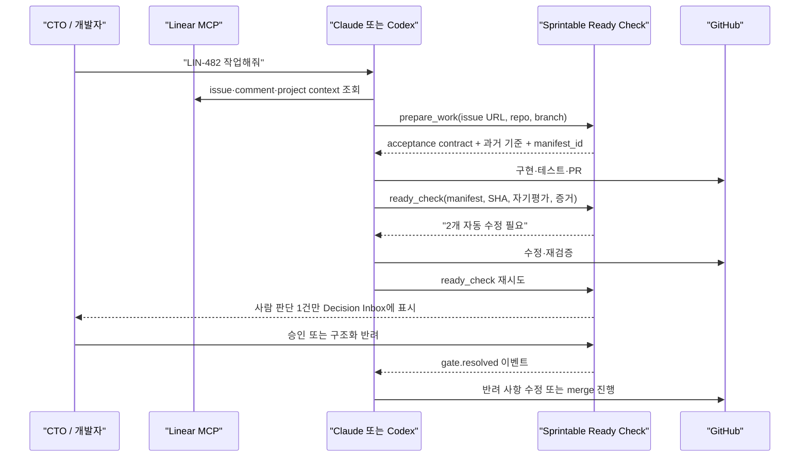
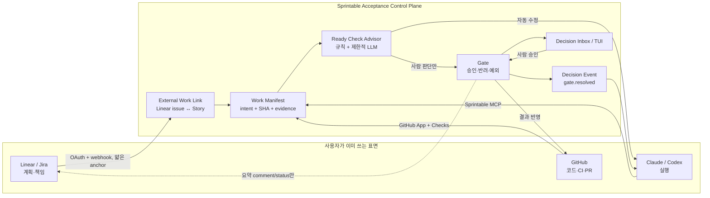

# 개발 CTO를 위한 Linear-first Gate Advisor 구현 제안

> 작성일: 2026-07-18  
> 대상: Claude Code·Codex를 매일 사용하고, Linear/Jira와 GitHub에서 여러 프로젝트의 최종 수락 책임을 지는 개발 CTO  
> 목적: 기존 Sprintable MCP·API를 깨지 않고 `Gate + Advisor`를 실제 개발 착수 가능한 수준으로 좁힌다.

---

## 0. 먼저 결론

이 기능은 시작할 가치가 있다. 다만 제품을 **“AI가 개발을 더 잘하게 해주는 또 하나의 코딩 도구”**로 만들면 안 된다.

Sprintable이 가져가야 할 자리는 다음 한 문장이다.

> **Linear가 일을 기억하고 Claude·Codex가 만들게 두되, Sprintable은 CTO가 보기 전에 완료 주장을 검증하고, 사람이 무엇을 근거로 수락했는지를 남긴다.**

초기 제품명과 사용자의 첫 화면도 `Advisor`보다 **Ready Check**가 더 적합하다.

- `Advisor`는 내부 메커니즘이다.
- `Ready Check`는 개발자가 매일 호출하는 행동이다.
- `Gate`는 merge·deploy처럼 되돌리기 비싼 경계에서만 작동한다.
- 최종 승인은 언제나 검증된 사람의 행위다.

가장 중요한 제품 전략은 **Linear에서 Sprintable로 모든 task를 옮기는 것**이 아니다.

1. 계획과 협업은 계속 Linear에서 한다.
2. 코드 사실은 계속 GitHub에서 본다.
3. Claude·Codex는 사용자가 원래 쓰던 채팅과 터미널에서 계속 일한다.
4. Sprintable은 먼저 `수락·반려·예외 승인·근거`의 정본이 된다.
5. 사용자가 매일 Sprintable의 Decision Inbox와 정책 기억을 찾게 된 뒤에만, 더 많은 워크플로우를 선택적으로 가져온다.

즉, **task migration이 아니라 acceptance migration이 먼저**다.

### 0.1 최종 범위 정정: 새 서브 프로젝트를 먼저 만들지 않는다

개발 착수 시점에는 Advisor를 별도 저장소·별도 서비스·별도 배포물로 만들지 않는다. **논리적으로만 분리된 Sprintable 내부 모듈**로 시작한다.

초기 구조:

```text
사용자 harness (Claude Code / Codex)
  ├─ Linear MCP로 issue context 조회
  ├─ Sprintable MCP로 advisor context 요청
  ├─ harness 내부의 별도 subagent/model로 local advisor 실행
  └─ Sprintable MCP로 self_review + 완료 보고

Sprintable backend
  ├─ Story / Gate / Evidence / 과거 reject context 조립
  ├─ advisor prompt·output schema 반환
  ├─ local advisor 결과를 "실행자 측 주장"으로 기록
  └─ 최종 사람 Gate와 감사 원장 유지
```

이 구조에서는 Sprintable이 처음부터 LLM runtime을 호스팅할 필요가 없다. harness가 이미 모델 실행·subagent·도구 호출을 담당하므로 이를 재사용한다.

중요한 구분:

- local harness Advisor가 자기 작업을 검토해도 된다. Advisor는 보안 경계나 최종 승인자가 아니기 때문이다.
- local Advisor 결과는 `독립 감사 증거`가 아니라 `사전 자기검토 주장`으로 표시한다.
- merge·deploy 승인 권한은 계속 Sprintable의 human Gate에만 둔다.
- Hosted Advisor, immutable Work Manifest, Linear server webhook은 local 실험에서 효능이 확인된 뒤 제품화 단계에 추가한다.

따라서 첫 구현은 새 `packages/advisor`보다 다음 세 지점이 적합하다.

```text
backend/app/services/advisor_context.py
backend/app/routers/advisor.py
backend/sprintable_mcp/tools/advisor.py
```

필요하면 `packages/cli`가 Claude·Codex용 advisor recipe/skill 설치를 돕는다. `connectors/`는 Hermes·OpenClaw처럼 Sprintable이 turn을 능동 주입해야 하는 자율 harness에만 사용한다.

별도 library나 repository로 추출하는 시점은 다음 조건 중 하나가 실제로 생겼을 때다.

1. Sprintable backend 없이 Advisor만 embed하려는 외부 harness 고객이 3곳 이상 생김
2. Advisor protocol을 독립 버전·독립 릴리스해야 함
3. 완전 offline/on-prem local runtime 요구가 반복됨
4. Claude·Codex 외 제3자 개발자가 SDK로 직접 통합하려는 수요가 확인됨

그 전에는 monorepo 내부 모듈이 변경 비용과 배포 위험이 가장 낮다.

---

## 1. 왜 개발 CTO가 첫 고객이어야 하는가

### 1.1 가장 날카로운 ICP

초기 ICP를 다음처럼 좁힌다.

> 2~20명 규모의 제품 개발팀에서 2개 이상의 저장소·프로젝트를 동시에 책임지고, Claude Code 또는 Codex를 매일 사용하며, 중요한 PR의 최종 merge 판단을 직접 하는 엔지니어 출신 CTO·대표.

이 사람은 코드 생성 속도가 느려서 고통받는 사람이 아니다. 오히려 생성량이 늘면서 다음 비용이 커진 사람이다.

- 여러 에이전트 세션에서 무엇이 바뀌었는지 다시 재구성한다.
- Linear의 요구사항과 실제 diff가 같은 일을 말하는지 확인한다.
- 테스트가 통과했다는 주장과 실제 실행 결과를 구분한다.
- migration, 권한, 결제, 배포 설정 같은 위험 변경을 놓치지 않으려 한다.
- 애매한 반려 사유를 다시 채팅창에 설명한다.
- 내가 승인한 것이 정확히 어느 SHA와 어느 증거 묶음인지 나중에 찾기 어렵다.
- 여러 프로젝트가 동시에 끝나면 `검토할 것`이 한꺼번에 몰린다.

### 1.2 이 고객의 Job to be Done

> **“내가 merge나 deploy를 결정하기 전에, 꼭 봐야 할 것만 압축해 보여주고, 기계적으로 고칠 수 있는 누락은 내게 오기 전에 에이전트에게 되돌려 보내라.”**

보조 Job은 다음과 같다.

1. “지금 내가 결정해야 하는 것만 한곳에서 보고 싶다.”
2. “왜 승인·반려했는지를 다음 작업에서 다시 설명하고 싶지 않다.”
3. “에이전트가 만든 결과를 빨리 받되, 내가 고무도장 승인자가 되고 싶지는 않다.”
4. “Linear와 GitHub를 버리지 않고 시작하고 싶다.”

### 1.3 초기 타깃이 아닌 고객

- 개인 토이 프로젝트만 가끔 만드는 개발자
- PR 수락 책임이 없는 순수 구현자
- 이미 모든 merge·deploy가 자동화되어 사람 판단이 거의 없는 팀
- 엄격한 문서 결재만 필요하고 코딩 에이전트를 쓰지 않는 조직
- Jira 전체 프로세스 이전이 구매의 전제인 대기업

이들을 모두 만족시키려 하면 Gate Advisor는 다시 범용 프로젝트 관리 기능이 된다.

---

## 2. 2026년 Linear 환경이 오히려 이 방향을 더 선명하게 만든다

Linear는 이미 공식 MCP를 통해 Claude·Codex에서 issue·project·comment를 읽고 쓰게 한다. 따라서 Sprintable이 Linear CRUD를 다시 프록시하거나 자체 MCP로 감싸는 것은 차별화가 아니다. 사용자는 Linear MCP와 Sprintable MCP를 **나란히** 쓰는 편이 낫다.

- Linear 공식 MCP: <https://linear.app/docs/mcp>
- Linear OAuth: <https://linear.app/developers/oauth-2-0-authentication>
- Linear webhook: <https://linear.app/developers/webhooks>

Linear의 Agent API는 인간 assignee를 유지하면서 agent를 delegate로 둔다. 이는 Sprintable이 이미 고민해 온 `owner ≠ executor ≠ approver` 모델과 잘 맞는다. 다만 Agent API는 현재 Developer Preview이므로 Sprintable 핵심 수락 회로가 여기에 종속되어서는 안 된다.

- Linear for Agents: <https://linear.app/developers/agents>
- Agent Interaction: <https://linear.app/developers/agent-interaction>
- Agent Interaction Guidelines: <https://linear.app/developers/aig>

이 변화가 뜻하는 바는 명확하다.

| 영역 | Linear가 이미 잘하는 것 | Sprintable이 가져가야 할 것 |
|---|---|---|
| 계획 | issue, project, cycle, priority | 가져가지 않음 |
| 에이전트 위임 | human assignee + agent delegate, session/activity | 실행의 최종 수락 계약 |
| 에이전트 컨텍스트 | issue·comment·guidance 전달 | 조직의 과거 승인 기준과 검증 계약 |
| 상태 가시성 | working, awaiting input, complete | `완료 주장이 실제로 받아들일 만한가` |
| 감사 | issue activity | 어떤 SHA·증거·판정으로 누가 승인했는가 |

따라서 Sprintable은 **오케스트레이터 경쟁**이 아니라 **acceptance control plane**을 택해야 한다.

---

## 3. 사용자가 매일 느껴야 하는 효능감

### 3.1 핵심 Aha Moment

CTO가 처음 감탄하는 순간은 “멋진 AI 요약”을 본 때가 아니다.

> **“내가 코드 리뷰에서 잡았을 문제를, 내가 보기 전에 에이전트가 고쳤다.”**

예:

- Linear 요구사항에는 관리자 권한 검증이 있는데 구현에는 UI 숨김만 있었다.
- PR의 테스트 결과는 이전 SHA 기준이었다.
- DB migration이 들어갔지만 rollback 또는 backward compatibility 증거가 없었다.
- 결제 경로를 변경했는데 실패·재시도 케이스가 빠졌다.
- issue 범위와 관계없는 파일이 대량으로 바뀌었다.
- 반려 후 수정했다고 했지만 반려된 항목 중 하나가 그대로였다.

Advisor는 이 중 기계적으로 확인 가능한 것을 먼저 처리하고, 제품 판단이 필요한 항목만 사람에게 보낸다.

### 3.2 매일의 기본 루프



### 3.3 다섯 가지 대표 유즈케이스

#### UC-1. 작업 시작 전에 요구사항 구멍을 찾는다

- Linear issue에는 “권한 처리”라고만 적혀 있다.
- `prepare_work`가 과거 같은 저장소의 반려 기록과 정책을 보고 확인 질문을 만든다.
- 질문은 “무슨 권한인가요?”가 아니라 선택 가능한 계약으로 나온다.
  - 조직 admin만 허용
  - project member도 허용
  - read-only user도 허용
- 사람이 답하면 그 답이 manifest의 acceptance contract가 된다.

효능: 에이전트가 잘못 구현한 뒤 전체를 되돌리는 일을 줄인다.

#### UC-2. CTO에게 오기 전에 증거 누락을 자동 수정한다

- 에이전트가 완료를 선언한다.
- Ready Check가 현재 head SHA와 CI SHA가 다른 것을 발견한다.
- 사람에게 gate를 만들지 않고 에이전트에 재실행을 요구한다.
- 최대 2회까지만 자동 반복하고 이후에는 이유와 함께 사람에게 올린다.

효능: 사람이 “테스트 다시 돌려주세요”라고 쓰는 반복을 없앤다.

#### UC-3. 여러 프로젝트의 판단만 한곳에 모은다

- Linear team과 repo가 달라도 Decision Inbox에는 다음 네 묶음만 보인다.
  - 지금 결정 필요
  - Advisor가 이미 고쳐서 다시 올라온 것
  - 정책 예외가 필요한 것
  - 자동 통과되어 참고만 할 것

효능: CTO가 Linear project와 GitHub PR 탭을 순회하지 않는다.

#### UC-4. 반려가 다음 작업의 사전 조언이 된다

- CTO가 “migration rollback 없음”을 코드와 함께 반려한다.
- 다음에 같은 repo에서 migration이 생기면 kickoff/preflight에 해당 기준이 먼저 나온다.
- 단, 한 번의 개인 취향을 즉시 조직 정책으로 승격하지 않는다. 반복 빈도와 조직 설정을 분리한다.

효능: 같은 설명을 반복하지 않는다.

#### UC-5. 저위험 변경에는 사람이 개입하지 않는다

- 문서 오탈자, 검증된 패턴의 작은 UI 변경, 기존 테스트가 충분한 단순 refactor는 Advisor만 통과한다.
- Gate가 생성되지 않거나 `auto_passed`로 기록된다.
- 사람은 원하면 사후 표본 감사만 한다.

효능: Gate가 새로운 병목이 되는 것을 막는다.

---

## 4. 제품 역할을 헷갈리지 않게 고정한다

| 역할 | 의미 | 제품상 주체 |
|---|---|---|
| Owner | 결과에 최종 책임을 지는 사람 | Linear의 human assignee / CTO·개발자 |
| Executor | 실제 변경을 수행한 주체 | Claude·Codex에 발급된 Sprintable agent credential + session |
| Advisor | 수락 전에 누락·모순·과거 기준을 찾는 분석기 | Sprintable service. 결정권 없음 |
| Approver | 특정 manifest를 승인·반려한 사람 | 검증된 human identity |
| Auditor | 사후에 결정과 근거를 검토하는 사람 | CTO, 보안 담당, 외부 감사자 |

중요한 예외가 하나 있다.

작은 팀에서는 Claude·Codex를 직접 조종한 CTO가 그 결과를 승인할 수 있다. 이것은 반드시 금지할 self-approval은 아니다. 실행 주체는 agent credential이고, 최종 결정은 사람이 별도의 승인 행위로 했기 때문이다.

다만 다음 두 조건이 필요하다.

1. 에이전트가 사람 대신 승인 명령을 실행할 수 없어야 한다.
2. 승인 대상이 어떤 SHA·manifest인지 사람이 명시적으로 확인해야 한다.

규제나 2인 통제가 필요한 조직에는 별도 정책으로 `controller_human_id != approver_human_id`를 강제한다.

---

## 5. 기존 코드에 대한 정직한 판정

### 5.1 이미 있는 좋은 기반

저장소에는 생각보다 많은 기반이 있다.

- `Gate` 상태기계와 사람 전용 transition endpoint
- `HitlRequest`와 조직·프로젝트별 gate level 설정
- `Evidence` 1급 객체와 MCP `sprintable_add_evidence`
- PR↔Story canonical link
- GitHub App 설치와 webhook 기반 처리 기반
- merge verdict gate와 advisory mode
- 사람 결정의 verdict·trust 환류
- agent event polling과 A2A gate 연결
- gate metrics와 rubber-stamp 관측

즉, 지금 필요한 것은 새 플랫폼이 아니라 **이미 있는 조각을 하나의 사용 가능한 회로로 닫는 일**이다.

### 5.2 현재 끊어진 부분

1. `report-done`은 REST에 있지만 MCP tool로 노출되지 않았다.
2. 완료 보고에는 summary, self-assessment, 실행 SHA, intent revision이 없다.
3. gate 승인·반려 결과가 agent event로 돌아가지 않는다.
4. `Gate`와 `HitlRequest`가 제품적으로 겹쳐 보이며, report-done에서 두 종류의 gate 집행이 연속 호출된다.
5. generic merge gate의 사람 승인에는 agent가 승인할 수 없다는 방어는 있으나, 실행 manifest와 approver ceremony의 강한 결속은 없다.
6. Linear/Jira 외부 MCP 연결을 위한 schema·TypeScript service는 있으나 project route의 GET은 빈 배열을 반환하고 POST는 확인되지 않은 FastAPI 경로로 proxy한다.
7. 승인 이력은 쌓이지만 Advisor가 재사용할 수 있는 구조화 반려 taxonomy와 immutable work snapshot이 없다.

### 5.3 두 Gate 구현을 더 늘리면 안 된다

새로운 `AdvisorGate`나 세 번째 상태기계를 만들지 않는다. 역할을 다음처럼 정리한다.

- **Gate**: 유일한 durable decision object이자 감사 원장
- **HitlRequest**: Gate를 특정 사람·채널에 전달하고 대기시키는 delivery request
- **Evidence**: 실행자가 제출한 개별 증거
- **Work Manifest**: 특정 시점의 intent·code·evidence·executor를 묶은 불변 수락 대상
- **Advisor Run**: manifest를 읽고 찾은 조언. 상태 전이를 소유하지 않음

단기에는 기존 HitlRequest를 유지하되, 새 코드가 HitlRequest를 독립 승인 원장처럼 사용하지 않게 한다. 모든 최종 결정은 Gate에 남아야 한다.

---

## 6. 권장 아키텍처: 기존 표면을 빌리고 수락 회로만 소유한다



### 핵심 불변식

1. Linear API가 잠시 실패해도 이미 만든 Ready Check와 Gate는 해소할 수 있어야 한다.
2. GitHub의 head SHA가 바뀌면 이전 승인은 자동으로 stale 처리한다.
3. Advisor는 Gate를 승인할 수 없다.
4. MCP에는 human approval tool을 제공하지 않는다.
5. 승인·반려는 manifest ID와 subject fingerprint에 묶인다.
6. Linear와 Sprintable 사이에 양방향 full mirror를 만들지 않는다.
7. Advisor 오류는 일반 작업을 막지 않는다. 단, 조직이 명시한 hard gate는 fail-open하지 않는다.

---

## 7. 기존 MCP·API를 최소한으로 건드리는 방법

### 7.1 사용자의 Claude·Codex에는 MCP 두 개가 함께 존재한다

```text
Linear MCP      → issue/project/comment를 읽고 수정
Sprintable MCP  → 수락 계약, 증거, Ready Check, 결정 수신
```

Sprintable이 Linear MCP 호출을 중계하지 않는다. 이는 불필요한 권한 집중과 장애 결합을 만든다.

### 7.2 최초 실험에서 Sprintable MCP 신규 tool은 두 개면 된다

기존 `sprintable_add_evidence`, `sprintable_poll_events`를 재사용한다.

Linear issue는 사용자의 기존 Linear MCP가 읽는다. 실험 단계에서는 기존 `sprintable_add_story`로 얇은 acceptance shell을 만들거나 이미 있는 Story를 사용한다. Sprintable이 Linear OAuth와 전체 동기화를 먼저 구현하지 않는다.

#### 1) `sprintable_advisor_context`

```json
{
  "story_id": "...",
  "moment": "preflight",
  "source_ref": "https://linear.app/.../issue/ENG-482/..."
}
```

응답:

```json
{
  "story_id": "...",
  "advisor_prompt": "Story, acceptance criteria, evidence, prior reject를 검토하고 아래 schema로 응답하라...",
  "input_bundle": {
    "acceptance_contract": [],
    "evidence": [],
    "prior_reject_patterns": []
  },
  "output_schema": {
    "verdict": "likely_pass | likely_reject | uncertain",
    "findings": [],
    "keep": []
  },
  "execution_recipe": {
    "require_separate_context": true,
    "recommended": "현재 실행자와 분리된 harness subagent/model"
  }
}
```

Harness는 이 prompt를 별도 subagent/model에 실행한다. 결과는 아직 Sprintable의 독립 판정이 아니라 실행자 측 `self_review`다.

#### 2) `sprintable_report_done`

현재 REST `POST /api/v2/workflow/report-done`의 얇은 MCP wrapper다.

```json
{
  "story_id": "...",
  "stage": "merge",
  "agent_id": "...",
  "head_sha": "...",
  "pr": {"repo": "acme/api", "number": 142},
  "summary": "project 접근 검증 추가",
  "self_review": {
    "mode": "local",
    "advisor_model": "...",
    "verdict": "likely_reject",
    "findings": [],
    "keep": []
  }
}
```

응답:

```json
{
  "decision": "fix_first",
  "attempt": 1,
  "findings": [
    {
      "code": "CI_SHA_MISMATCH",
      "severity": "must_fix",
      "fact": "CI result is for 17ab, current head is 92cd",
      "action": "Run required checks on 92cd and resubmit"
    }
  ],
  "gate_id": null,
  "requires_human": false
}
```

가능한 decision은 세 개로 제한한다.

- `fix_first`: 사람에게 올리지 않고 에이전트가 수정
- `ready`: 사람 gate가 필요 없는 저위험 완료
- `needs_human`: Gate를 만들고 사람 판단 대기

### 7.3 REST는 기존 report-done을 깨지 않고 Advisor hook을 추가한다

새 내부 서비스 `build_ready_check()`를 만든다.

- 신규 MCP `sprintable_report_done`은 기존 endpoint를 호출한다.
- 기존 `POST /api/v2/workflow/report-done`의 `merge` 단계가 feature flag 아래에서 `build_ready_check()`를 호출한다.
- 기존 request 필드는 모두 유지한다.
- 다음 optional field만 additive하게 받는다.
  - `summary`
  - `self_review`
  - `head_sha`
  - `intent_hash`

기존 client가 새 필드를 보내지 않으면 현재 동작을 유지한다. 이 방식이면 API version을 올리지 않고도 점진 적용할 수 있다.

P0에서는 `head_sha`, `intent_hash`, `self_review` snapshot을 기존 Gate의 `neutral_facts`에 저장해도 충분하다. 효능이 확인되기 전에 `work_manifest` 테이블을 선행 조건으로 만들지 않는다. 반복 제출·stale approval·감사 요구가 실제로 확인되면 P1에서 immutable Work Manifest로 승격한다.

### 7.4 결정 반환에는 기존 Event transport를 쓴다

새 polling 시스템을 만들지 않는다. 기존 `sprintable_poll_events`가 받는 `events`에 `gate.resolved` literal을 추가한다.

```json
{
  "event_type": "gate.resolved",
  "source_entity_type": "story",
  "source_entity_id": "...",
  "payload": {
    "gate_id": "...",
    "work_manifest_id": "...",
    "decision": "rejected",
    "subject_sha": "92cd...",
    "keep": ["권한 검증 구조", "테스트 fixture"],
    "change": [
      {"code": "MISSING_NEGATIVE_TEST", "criterion_id": "ac-1", "instruction": "..."}
    ],
    "next_action": "revise_and_resubmit"
  }
}
```

### 7.5 사람 승인 API는 MCP에 노출하지 않는다

기존 `/api/v2/gates/{id}/transition`은 human member만 허용한다. 이 경계를 유지한다.

다만 TUI를 제공할 때 단순 bearer token만으로 승인하면 안 된다. 코딩 에이전트가 같은 shell에서 CLI를 실행해 사람인 척 승인할 수 있기 때문이다.

고위험 TUI 승인 흐름은 다음 중 하나를 요구한다.

1. TUI는 읽기 전용이고 승인은 browser의 human session에서 완료
2. TUI가 서버의 single-use challenge를 받고 Touch ID/passkey로 서명
3. OS Keychain의 user-presence 요구 credential을 통해 gate+manifest+SHA nonce를 서명

**환경변수에 든 token으로 `sprintable gate approve`가 바로 성공하는 구현은 금지한다.**

---

## 8. 최소 데이터 모델 변경

### 8.1 기존 모델 재사용

| 기존 모델 | 재사용 방식 |
|---|---|
| `Story` | Linear issue의 acceptance shell. full mirror가 아님 |
| `PullRequestStoryLink` | PR↔acceptance shell 연결 |
| `Evidence` | 개별 실행 증거 |
| `Gate` | 유일한 최종 결정 원장 |
| `HitlRequest` | 사람에게 Gate를 전달하는 대기 요청 |
| `Event` | gate.resolved를 agent에 반환 |
| `org_integrations` | Linear OAuth credential·webhook config 저장 |

### 8.2 새 테이블 1: `external_work_link`

Linear 전체 issue를 import하지 않고 필요한 issue만 Story에 연결한다.

```text
id
org_id
project_id
story_id
provider              linear | jira
workspace_id
team_id
external_issue_id
external_identifier   ENG-482
external_url
source_updated_at
source_hash
last_seen_at
```

유니크 키는 `(org_id, provider, external_issue_id)`다.

동기화 규칙:

- `prepare_work` 최초 호출 때만 Story shell을 만든다.
- title·description·acceptance criteria는 intent snapshot을 만들기 위한 입력이지 양방향 정본이 아니다.
- Sprintable status를 Linear workflow status에 강제로 매핑하지 않는다.
- 결과는 Linear comment 또는 attachment link로만 반영한다.

### 8.3 새 테이블 2: `work_manifest`

Gate가 “현재 Story”가 아니라 **특정 완료 주장**을 승인하도록 만든다.

```text
id
org_id
project_id
story_id
external_work_link_id
parent_manifest_id     재시도 전 manifest
attempt
executor_member_id
executor_session_id
intent_snapshot        JSONB
intent_hash
repo
base_sha
head_sha
pr_number
evidence_snapshot      JSONB
self_assessment        JSONB
advisor_result         JSONB
status                 prepared | checking | fix_first | ready | gated | superseded
created_at
```

Manifest는 update로 내용을 바꾸지 않는다. 재시도마다 새 manifest 또는 immutable revision을 만든다.

### 8.4 Gate에 additive field 두 개

- `work_manifest_id` nullable
- `resolution_payload` JSONB nullable

기존 `resolution_note`는 사람용 자유 메모로 유지한다. `resolution_payload`에는 코드로 다시 실행할 수 있는 `keep/change/criterion/code`를 둔다.

초기에는 별도 `advisor_run` 테이블을 만들지 않아도 된다. Advisor 결과는 manifest에 snapshot으로 남긴다. 모델 버전 비교·replay가 실제로 필요해지는 P2에 분리한다.

---

## 9. Advisor는 처음부터 LLM 중심으로 만들지 않는다

### 9.1 1차 Advisor: 결정론적 Ready Check

CTO가 신뢰하려면 같은 입력에 같은 핵심 판정이 나와야 한다.

초기 rule 예:

| rule | 결과 |
|---|---|
| current head SHA와 CI SHA 불일치 | fix_first |
| required check 실패·미실행 | fix_first |
| PR link 없음 | fix_first 또는 정보 요청 |
| intent snapshot 이후 Linear 요구사항 변경 | manifest stale, 재준비 |
| acceptance criterion에 evidence 없음 | fix_first |
| migration 변경 + rollback/compatibility 증거 없음 | needs_human 또는 fix_first |
| auth·billing·permission 경로 변경 | hard gate 후보 |
| issue scope와 무관한 대량 파일 변경 | needs_human |
| 이전 reject criterion이 그대로 unmet | fix_first |

### 9.2 2차 Advisor: 제한된 LLM 판단

LLM은 다음처럼 정적 rule로 판단하기 어려운 경우에만 쓴다.

- 요구사항과 diff의 의미 불일치 후보
- 빠진 failure mode 후보
- 과거 반려 사유와 현재 변경의 의미상 유사성
- 사람이 읽기 좋은 3줄 판단 요약

LLM output은 사실과 추론을 분리한다.

```json
{
  "facts": ["migration file added", "no rollback evidence linked"],
  "inferences": [
    {"text": "zero-downtime compatibility may be unverified", "confidence": 0.71}
  ],
  "recommendation": "needs_human"
}
```

### 9.3 과거 승인 데이터는 데이터가 생긴 뒤에 쓴다

기존 Gate Advisor 계획의 `advisor_prior`를 첫 구현 순서로 두면 cold start에서 효능이 약하다.

순서를 바꾼다.

1. manifest와 구조화 reject를 먼저 수집
2. deterministic rule로 첫 rescue를 만든다
3. 반복 reject taxonomy를 집계한다
4. 조직 prior를 kickoff/preflight에 노출한다
5. 충분한 표본이 생긴 뒤 자동 완화·강화 calibration을 검토한다

한 사람의 한 번의 취향을 조직 정책으로 오인하지 않도록 다음을 구분한다.

- `hard_policy`: 관리자가 명시적으로 설정
- `repeated_preference`: 같은 유형이 반복됨
- `single_decision`: 참고만 함
- `global_playbook`: 일반 권고이며 조직 판정 근거보다 우선하지 않음

---

## 10. Linear-first 온보딩과 Sprintable로의 자연스러운 이동

### 10.1 온보딩 목표: 15분 안에 첫 Ready Check

초기 화면은 “workspace import”가 아니라 다음 세 단계다.

1. **Connect Linear**: OAuth로 workspace와 한 team 선택
2. **Connect GitHub**: 기존 GitHub App 설치, 한 repo 선택
3. **Add Sprintable MCP**: Claude Code·Codex 공통 설정 복사 또는 설치 명령

그 다음 샘플 import를 시키지 않는다. 현재 작업 중인 Linear issue URL 하나로 바로 Ready Check를 만든다.

### 10.2 기존 project MCP connection scaffold를 그대로 온보딩으로 쓰지 않는다

현재 저장소의 `approved_mcp_servers`와 `project-mcp.ts`는 외부 MCP를 project runtime에 주입하는 기반이다. 그러나 실제 project route는 아직 live connection UX로 완결되지 않았다.

더 중요한 문제는 제품 의미다. Linear MCP 연결과 Sprintable 서버의 Linear integration은 다른 목적이다.

- 사용자 agent의 Linear MCP: 사용자가 자신의 Linear를 읽고 쓰기 위함
- Sprintable Linear OAuth: webhook 수신, issue anchor 확인, 결과 comment 반영을 위함

따라서 외부 MCP gateway 기능을 억지로 onboarding 핵심으로 삼지 않는다. `org_integrations` 저장소만 재사용하고, GitHub integration과 동형의 얇은 Linear OAuth adapter를 별도로 만든다.

### 10.3 단계별 value migration

#### 단계 A — Shadow

- Linear와 GitHub를 계속 주 화면으로 사용
- Sprintable은 Ready Check 결과를 GitHub Check와 Linear comment로만 보여준다
- merge 차단 없음

#### 단계 B — First Rescue

- 실제 누락 한 건을 사람 전에 찾아 agent가 수정
- 사용자는 Sprintable에서 “검토 1회 절약” receipt를 본다
- 과장된 시간 절약 수치 대신 무엇을 미리 잡았는지 보여준다

#### 단계 C — Selective Gate

- migration, auth, billing, deploy 등 되돌리기 비싼 경계만 Gate 활성화
- Decision Inbox/TUI가 매일의 시작점이 된다

#### 단계 D — Decision Memory

- 반복 반려가 kickoff advice와 policy candidate로 돌아온다
- CTO가 같은 말을 반복하지 않게 된다

#### 단계 E — Optional Native Workflow

- 사용자가 원하면 Sprintable의 org-level My Work, multi-project workflow, agent identity를 더 쓴다
- Linear task를 강제 이전하지 않는다

이 이동 경로의 핵심은 **Sprintable을 열어야만 일할 수 있게 만드는 것**이 아니라, **Sprintable을 열면 판단이 훨씬 빨라져서 자발적으로 열게 만드는 것**이다.

---

## 11. GitHub 표면은 Linear보다 깊게 쓴다

실제 수락 대상은 issue가 아니라 commit과 PR이다. 따라서 Linear는 얇게, GitHub는 깊게 연동한다.

GitHub App은 check run을 만들고 SHA별 상태·annotation·action을 표시할 수 있다. Check write는 GitHub App 권한이 필요하므로 현재 GitHub App 기반과 잘 맞는다.

- GitHub Checks 공식 문서: <https://docs.github.com/en/rest/guides/using-the-rest-api-to-interact-with-checks>

권장 Check 이름:

```text
Sprintable / Ready Check
```

결론 매핑:

| Sprintable | GitHub Check | 의미 |
|---|---|---|
| checking | in_progress | 분석 중 |
| fix_first | action_required 또는 failure | agent 수정 필요 |
| ready | success | 현재 policy상 사람 gate 없음 |
| needs_human | action_required | 사람 판단 대기 |
| approved | success | manifest+SHA 승인 |
| stale | action_required | 승인 후 SHA 변경 |

Check output에는 최대 3개 핵심 항목만 보이고, 상세 manifest는 Sprintable로 연결한다.

---

## 12. TUI 승인 UX와 승인 무결성

개발 CTO에게 TUI는 의미가 있다. 브라우저를 강제로 열지 않고 여러 repo의 결정을 빠르게 처리할 수 있기 때문이다.

```text
┌ Sprintable Decision Inbox ───────────────────────────┐
│ 3 need decision · 4 auto-fixed · 12 passed           │
├───────────────────────────────────────────────────────┤
│ ENG-482  acme/api#142  migration + auth              │
│ SHA 92cd  CI ✓  AC 5/5  Advisor: 1 human judgment    │
│                                                       │
│ Fact: role enum migration adds NOT NULL column        │
│ Missing: backward-compatible deploy plan              │
│                                                       │
│ [v] View diff  [e] Evidence  [a] Approve  [r] Reject  │
└───────────────────────────────────────────────────────┘
```

하지만 TUI는 “같은 터미널에 있으니 안전하다”가 아니다. 에이전트가 shell command를 실행할 수 있기 때문이다.

승인 ceremony:

1. TUI가 gate, manifest, head SHA를 표시한다.
2. 서버가 이 세 값에 묶인 single-use challenge를 발급한다.
3. 사람이 Touch ID/passkey 또는 browser 확인을 한다.
4. 서버는 human identity, device assertion, challenge, manifest, SHA를 함께 검증한다.
5. 승인 직후 SHA가 바뀌면 stale 처리한다.

낮은 위험도에서는 browser session confirmation만으로 시작할 수 있다. 그러나 agent가 접근 가능한 API key·환경변수만으로 승인이 되는 CLI는 제공하지 않는다.

---

## 13. 기존 계획 대비 무엇을 바꿔야 하는가

### 유지할 것

- Advisor는 judge가 아니라 coach
- kickoff는 선택적, preflight는 자동
- local/hosted mode의 장기 옵션
- 최대 자동 재시도 2회
- Advisor 장애는 fail-open
- 승인 데이터의 조직 기억화
- GitHub 깊게, Linear 얇게
- Gate 결과를 agent에 되돌리는 `gate.resolved`

### 순서를 바꿀 것

| 기존 우선순위 | 수정 제안 |
|---|---|
| advisor prior aggregation 먼저 | manifest + structured reject + decision return 먼저 |
| local BYO Advisor를 빠른 가치로 | deterministic Ready Check를 빠른 가치로 |
| hosted/local model 선택 강조 | 첫 rescue와 승인 무결성 강조 |
| Linear hook 후순위 | Linear를 첫 onboarding 표면으로, core dependency는 아님 |
| UI는 이후 | CTO Decision Inbox의 최소 버전은 gated beta 전에 필요 |
| report-done 중심 | 공용 ready_check service를 MCP와 report-done 양쪽에서 호출 |

### 추가할 것

- immutable Work Manifest
- SHA-bound approval과 stale 처리
- agent가 호출할 수 없는 human approval ceremony
- External Work Link와 no-mirror 원칙
- first-rescue receipt
- Gate/HitlRequest 역할 통합 원칙

---

## 14. 현재 완성도와 단계별 기대 완성도

아래 수치는 고객 효능이나 테스트 커버리지가 아니다. **현재 코드와 설계 산출물을 기반으로 한 구현 준비도 추정치**다. 실제 수치는 pilot 행동 데이터로 교체해야 한다.

| 영역 | 가중치 | 현재 | 근거 |
|---|---:|---:|---|
| Gate·승인 안전 기반 | 20 | 13 | Gate FSM, human-only transition, audit 존재. manifest 결속과 generic SoD 보완 필요 |
| Evidence·PR 사실 기반 | 15 | 11 | Evidence와 PR link, GitHub App 존재 |
| Agent 왕복 회로 | 20 | 6 | report-done 존재. MCP 진입과 gate.resolved가 없음 |
| Linear-first onboarding | 15 | 4 | schema/service scaffold 존재. 실제 route와 adapter 미완성 |
| Advisor 유용성 | 15 | 2 | 설계는 있으나 runtime·rule·calibration 없음 |
| CTO daily UX·관측 | 15 | 5 | gate UI/metrics 일부 존재. Decision Inbox·first rescue receipt 없음 |
| **합계** | **100** | **41** | 기반은 있으나 end-to-end 가치 회로가 끊겨 있음 |

목표 준비도:

| 단계 | 목표 | 준비도 추정 | 종료 조건 |
|---|---|---:|---|
| P0 Circuit Close | 한 작업이 agent→gate→agent로 왕복 | 55 | manifest, ready_check MCP, gate.resolved |
| P1 Linear Shadow | CTO가 기존 도구를 안 버리고 사용 | 68 | OAuth/webhook, 1 team/repo, GitHub Check, no blocking |
| P2 Gated Beta | 중요한 merge만 사람 결정 | 78 | SHA-bound approval, Decision Inbox, stale handling |
| P3 Learned Advisor | 반복 결정이 다음 작업을 개선 | 86 | reject taxonomy, prior, calibration dashboard |

`100`을 목표로 하지 않는다. Jira, deploy provider, enterprise policy까지 동시에 넣으면 첫 효능이 늦어진다.

---

## 15. 6주 개발 제안

팀 규모를 모르므로 주 단위는 절대 일정이 아니라 한 스쿼드 기준의 우선순위 프레임이다.

아래 6주는 바로 전부 착수하는 계획이 아니다. 먼저 1~2주의 **P0 Harness-local Advisor 실험**을 통과한 뒤의 제품화 계획이다.

### P0 — Harness-local Advisor 실험 (1~2주)

- `advisor_context` 서비스와 MCP tool
- `report-done` MCP wrapper + optional `self_review`
- Claude·Codex용 실행 recipe
- 기존 Story·Evidence·Gate·Event만 사용
- Advisor 결과는 `neutral_facts`에 local claim으로 기록
- Linear context는 기존 Linear MCP를 통해 harness가 전달
- hosted model, Linear OAuth, 신규 manifest table은 만들지 않음

**GO 조건:** 실제 작업 10건 안에서 최소 2건 이상 “사람에게 가기 전에 수정할 가치가 있었던 finding”이 나오고, CTO가 그 finding의 과반을 유효하다고 평가한다. 이 값은 시장 사실이 아니라 제품화 투자 여부를 정하기 위한 작은 실험 기준이다.

GO 조건을 통과하면 아래 Week 1부터 durable productization을 시작한다.

### Week 1 — 수락 대상 고정

- `external_work_link`, `work_manifest` migration/model/service
- Story shell 생성과 Linear issue snapshot
- intent hash, head SHA, executor session 결속
- 기존 PR↔Story link 재사용
- 단위 테스트: org isolation, idempotent prepare, stale intent

**종료 조건:** Linear issue URL 하나로 immutable manifest가 만들어진다.

### Week 2 — agent 왕복 회로 닫기

- `sprintable_prepare_work`
- `sprintable_ready_check`
- 기존 `add_evidence`, `poll_events` 재사용
- `gate.resolved` event와 structured reject payload
- report-done merge hook을 공용 ready_check service에 feature flag로 연결

**종료 조건:** Codex/Claude가 사람 반려를 받아 수정 후 같은 작업을 다시 제출한다.

### Week 3 — deterministic Advisor와 GitHub Shadow Check

- SHA/CI/required evidence/stale intent rule
- 최대 2회 자동 수정 loop
- GitHub `Sprintable / Ready Check`
- check 상세 링크와 top 3 finding
- blocking은 아직 끔

**종료 조건:** 실제 PR에서 CTO가 잡을 누락 한 건을 사람 전에 수정하는 first rescue를 재현한다.

### Week 4 — Linear onboarding

- Linear OAuth start/callback/status/webhook adapter
- webhook HMAC·timestamp·delivery idempotency
- team 1개, repo 1개 선택
- issue comment에 Ready Check 결과 링크
- project MCP stub을 onboarding dependency로 사용하지 않음

**종료 조건:** 새 사용자가 15분 내 현재 Linear issue로 첫 Ready Check를 실행한다.

### Week 5 — Decision Inbox와 안전한 승인

- 웹 Decision Inbox 최소 버전
- TUI read/view + browser/passkey approval challenge
- manifest+SHA-bound approve/reject
- SHA 변경 시 stale
- migration/auth/billing만 selective gate

**종료 조건:** 에이전트 credential만으로 승인할 수 없고, CTO가 여러 repo 판단을 한 화면에서 처리한다.

### Week 6 — pilot 측정과 구조화 학습

- reject code taxonomy
- first rescue receipt
- false interruption feedback
- 정책 후보와 단일 결정 분리
- Jira 개발이 아니라 Linear pilot 관측·수정에 집중

**종료 조건:** 아래 실험 지표를 실제 5~8개 design partner 팀에서 수집할 수 있다.

---

## 16. pilot 가설과 측정

### 16.1 핵심 가설

> AI 코딩을 매일 하는 CTO는 task 자동화보다, 사람에게 오기 전 검증 누락을 고치고 승인 판단을 압축하는 도구를 반복 사용한다.

### 16.2 2주 pilot 설계

- 5~8명의 개발 CTO·리드
- Linear + GitHub 사용
- Claude Code 또는 Codex 주 3회 이상
- 1주차 shadow, 2주차 선택적 gate
- auth/migration/billing 중 최소 한 종류를 포함한 실제 PR 사용

### 16.3 목표값은 사실이 아니라 실험 기준이다

| 지표 | 초기 목표 | 의미 |
|---|---:|---|
| 15분 내 첫 Ready Check 성공 | 참여자의 70% 이상 | onboarding 마찰 |
| 연결된 PR 중 Ready Check 실행률 | 60% 이상 | daily loop 적합성 |
| 첫 3개 PR 안에 first rescue 경험 | 참여자의 40% 이상 | 즉시 효능 |
| Advisor finding 수용·수정률 | 60% 이상 | 조언 정밀도 |
| 사람에게 올라간 false interruption | 15% 이하 | gate 피로도 |
| reject→agent 수정→재제출 중간값 | 15분 이하 | 왕복 회로 효율 |
| 2주차 주 3일 이상 재사용 | 참여자의 50% 이상 | 반복 사용성 |

이 목표는 시장 benchmark가 아니다. pilot을 중단하거나 개선 방향을 정하기 위한 사전 기준이다.

### 16.4 시간 절약을 과장하지 않는 법

`gate created_at → resolved_at`만으로 “리뷰 시간을 절약했다”고 말하면 안 된다. 대기 시간과 실제 검토 시간이 섞여 있기 때문이다.

대신 다음 receipt를 먼저 보여준다.

- 사람에게 가기 전에 수정된 finding 수
- CTO가 직접 reject하지 않아도 된 반복 항목 수
- stale SHA 승인을 차단한 횟수
- Ready Check가 자동 통과시킨 저위험 변경 수
- structured reject가 재제출에서 해결된 비율

실제 시간 효능은 TUI focus/blur, diff open, decision action 같은 review interaction telemetry를 최소 수집한 뒤 추정한다.

---

## 17. 주요 위험과 대응

| 위험 | 왜 위험한가 | 대응 |
|---|---|---|
| Advisor가 잔소리 도구가 됨 | CTO가 끄고 돌아오지 않음 | shadow default, top 3, irreversible boundary만 gate |
| cold start | 승인 prior가 없어 조언이 빈약 | deterministic rule과 evidence contract 먼저 |
| Linear 이중 SSOT | sync conflict와 사용자 불신 | External Work Link + snapshot, full mirror 금지 |
| agent 자동 승인 | 감사 무결성 붕괴 | approval MCP 없음, user-presence challenge |
| 승인 후 코드 변경 | 다른 코드를 승인한 셈 | manifest+head SHA 결속, 자동 stale |
| Gate와 HITL 중복 | 세 번째 시스템으로 복잡도 폭증 | Gate=원장, HITL=delivery로 역할 고정 |
| LLM 오판 | 불안정한 block | facts/rules 우선, LLM은 inference, Advisor fail-open |
| Linear Agent API 변경 | Developer Preview 종속 | OAuth/webhook stable path가 core, Agent Session은 optional adapter |
| Jira까지 동시 개발 | 학습 속도 저하 | Linear pilot 성공 후 external adapter 계약으로 확장 |

---

## 18. 지금 만들지 말아야 할 것

1. Linear 전체 workspace import와 양방향 status sync
2. Sprintable이 Linear 공식 MCP를 proxy하는 gateway
3. 별도의 coding harness 또는 Claude·Codex 대체 채팅창
4. Advisor가 스스로 approve하는 기능
5. 세 번째 Gate 상태기계
6. 데이터가 없는데 먼저 만드는 복잡한 approval ML score
7. 모든 PR을 처음부터 required check로 막는 기능
8. Linear와 Jira 동시 GA
9. “몇 시간을 절약했다”는 검증되지 않은 대시보드
10. CTO가 매번 긴 form을 채워야 하는 승인 UI

---

## 19. 최종 제품 문장

### 외부 메시지

> **Your agents finish the code. Sprintable makes it ready for your decision.**

한국어:

> **에이전트는 코드를 끝냅니다. Sprintable은 CTO가 결정할 수 있는 상태로 만듭니다.**

### Linear 사용자에게

> Linear를 바꾸지 마세요. Sprintable은 issue와 PR 사이에서 완료 증거를 만들고, 사람에게 필요한 결정만 올립니다.

### 가장 중요한 demo

1. Linear issue를 Codex에 맡긴다.
2. Codex가 PR을 만든다.
3. Ready Check가 사람이 잡을 누락을 발견한다.
4. Codex가 자동으로 고친다.
5. CTO에게는 제품 판단 한 건만 올라온다.
6. CTO가 반려하면 구조화된 이유가 Codex로 돌아간다.
7. 다음 유사 작업 시작 때 같은 기준이 먼저 제시된다.

이 7단계가 끊김 없이 보이면 “정말 좋네”가 나온다. 멋진 Advisor 문장보다 이 왕복 회로가 먼저다.

---

## 20. 개발 착수 판정

**GO. 단, 범위는 `Linear-first Ready Check + selective Gate`로 제한한다.**

첫 구현의 성공은 Advisor 모델의 지능이 아니다.

1. agent가 완료 주장을 manifest로 제출한다.
2. 기계적으로 고칠 누락은 사람 전에 되돌아간다.
3. 사람 판단이 필요한 것만 SHA에 묶여 올라온다.
4. 결정이 다시 agent로 돌아간다.
5. 다음 작업이 그 결정으로 조금 더 좋아진다.

이 다섯 가지가 완성되면 현재 약 41/100인 구현 준비도는 gated pilot이 가능한 약 78/100까지 올라갈 수 있다. 그 뒤의 학습형 Advisor는 이미 작동하는 수락 회로 위에 올려야 한다.

---

## 부록 A. 저장소 근거와 예상 수정 지점

이 제안은 개념 문서만 보고 만든 것이 아니라 현재 구현 경계를 확인해 작성했다.

| 판단 | 현재 근거 | 예상 변경 |
|---|---|---|
| Gate를 새로 만들 필요 없음 | `backend/app/models/gate.py`, `backend/app/services/gate_service.py` | manifest link와 structured resolution만 additive |
| agent가 사람 Gate를 승인할 수 없음 | `backend/app/routers/gates.py`의 human member 검사 | TUI user-presence와 SHA binding 보강 |
| 완료 보고 기반 존재 | `backend/app/routers/workflow_report.py` | optional manifest/self-assessment field + 공용 ready_check service 호출 |
| merge 판단 기반 존재 | `backend/app/services/merge_verdict_gate.py` | deterministic finding을 입력으로 통합 |
| Evidence MCP 존재 | `backend/app/models/evidence.py`, `backend/sprintable_mcp/tools/evidence.py` | 그대로 재사용 |
| agent decision polling 존재 | `backend/app/models/event.py`, `backend/sprintable_mcp/tools/agent_runs.py` | `gate.resolved` event literal과 payload 추가 |
| PR↔Story 연결 존재 | `backend/app/models/pull_request_story_link.py`, `backend/app/routers/github_integration.py` | 그대로 재사용 |
| MCP scope catalog 존재 | `backend/app/services/mcp_toolset.py`, `backend/sprintable_mcp/toolset.py` | 신규 tool 2개를 양쪽 catalog에 동기화 |
| Linear/Jira integration 저장 기반 존재 | `packages/db/supabase/migrations/20260408183000_approved_mcp_servers.sql`, `apps/web/src/services/project-mcp.ts` | `org_integrations` 재사용, onboarding 의미는 별도 adapter |
| 현재 MCP connection route 미완결 | `apps/web/src/app/api/projects/[id]/mcp-connections/route.ts` | Ready Check onboarding의 선행 의존성으로 두지 않음 |
| Gate와 HITL가 중첩 | `backend/app/services/gate_enforce.py`, `backend/app/models/hitl.py`, `backend/app/routers/workflow_report.py` | Gate=원장, HitlRequest=delivery 계약으로 수렴 |

기존 설계 문서 중 직접 이어지는 문서:

- `docs/superpowers/specs/2026-07-15-gate-advisor-design.md`
- `docs/analysis/proof-of-done-packet-design-2026-07-12.md`
- `docs/analysis/integration-strategy-linear-github-2026-07-15.md`
- `docs/analysis/problem-hypothesis-sharpening-2026-07-17.md`
- `docs/analysis/first-principles-atoms-2026-07-17.md`

### 구현 시 테스트 우선순위

1. agent API key로 gate transition 불가
2. 다른 org/project의 manifest·issue·PR 접근 불가
3. 동일 Linear delivery의 중복 webhook이 manifest를 중복 생성하지 않음
4. 승인된 manifest와 다른 head SHA는 merge success가 될 수 없음
5. reject payload가 해당 executor에게만 전달됨
6. 기존 report-done client는 optional field 없이 동일하게 동작
7. Advisor 장애 시 shadow 작업은 지속되며 hard policy만 보존
8. HitlRequest 중복 park가 Gate 중복 결정을 만들지 않음

---

## 부록 B. 첫 구현 PR을 나누는 방법

큰 기능 브랜치 하나로 만들지 않는다.

1. **PR-0A: Harness-local Advisor context**  
   context assembler, MCP tool, Claude·Codex recipe, no schema migration
2. **PR-0B: Report-done MCP loop**  
   existing REST wrapper, optional self_review, local claim recording, gate.resolved return
3. **GO/NO-GO: 실제 작업 10건 효능 검토**
4. **PR-1: Work manifest foundation — GO 이후**  
   migration, model, repository, immutable revision test
5. **PR-2: Prepare Work productization**  
   external link, Story shell, MCP scope·contract test
6. **PR-3: Ready Check service**  
   deterministic rules, existing report-done compatibility test
7. **PR-4: Gate decision return hardening**  
   gate.resolved event, recipient isolation, structured reject
8. **PR-5: GitHub shadow check**  
   check run lifecycle, SHA stale behavior
9. **PR-6: Linear OAuth/webhook adapter**  
   signature, replay, idempotency, thin reflection
10. **PR-7: Decision Inbox and secure approval challenge**  
   browser first, TUI read path second

각 PR은 feature flag 아래에서 독립적으로 배포할 수 있어야 한다. 특히 PR-0A~0B만으로 Claude·Codex의 local Advisor 효능과 왕복 회로를 먼저 검증할 수 있으므로 Linear OAuth나 신규 데이터 모델이 늦어져도 핵심 학습은 계속된다.
